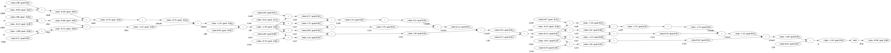

# Go-Micrograd

### Backward Pass Graph of the expression - Backpropogation


#### To run the example of backpropogation

```console
foo@bar:~$ cd examples/backpropogation
foo@bar:~$ go run .
```

**_NOTE:_**  The image is created as `outimage.png` under examples/backpropogation package

### Multi Layer Perceptron - With expression graph



#### To run the example of backpropogation

```console
foo@bar:~$ cd examples/mlp
foo@bar:~$ go run .
```

**_NOTE:_**  The image is created as `outimage.png` under examples/mlp package

##### inspired from https://github.com/karpathy/micrograd
