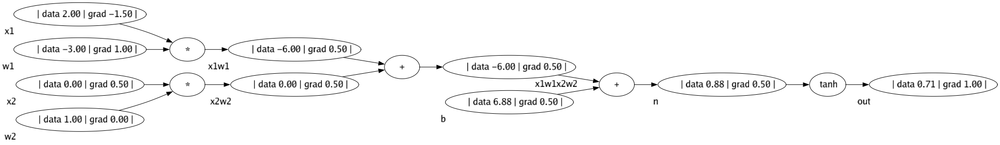
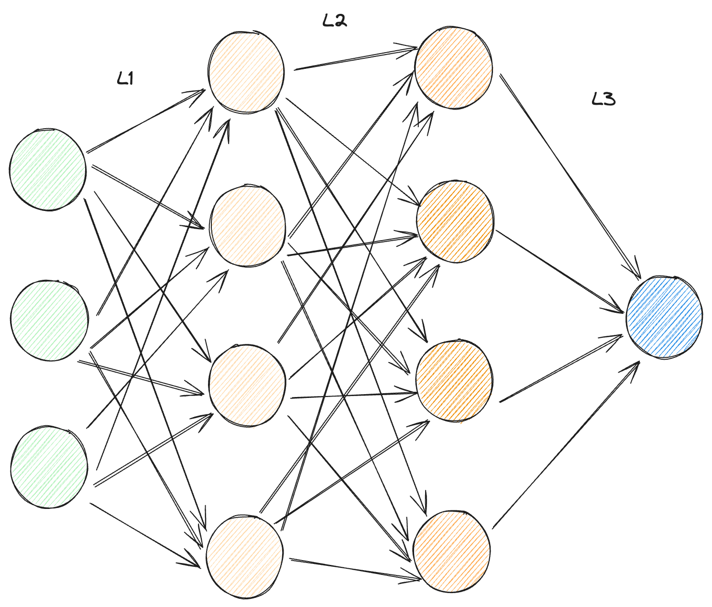

# Go-Micrograd

### Backward Pass Graph of the expression - Backpropogation



#### To run the example of backpropogation

```console
foo@bar:~$ cd examples/backpropogation
foo@bar:~$ go run .
```

**_NOTE:_**  The image is created as `outimage.png` under examples/backpropogation package

### Multi Layer Perceptron - With expression graph

Below is a MLP(3,4,4,1) of which expression graph is visualized



Expression graph of above MLP


#### To run the example of backpropogation

```console
foo@bar:~$ cd examples/mlp
foo@bar:~$ go run .
```

**_NOTE:_**  The image is created as `outimage.png` under examples/mlp package

##### inspired from https://github.com/karpathy/micrograd
